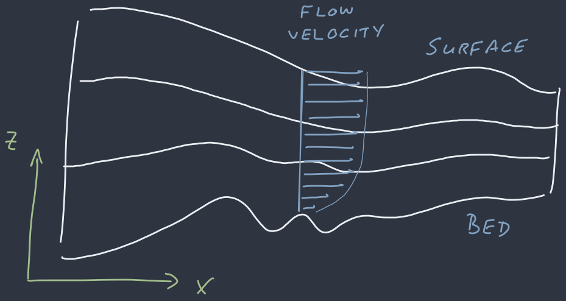
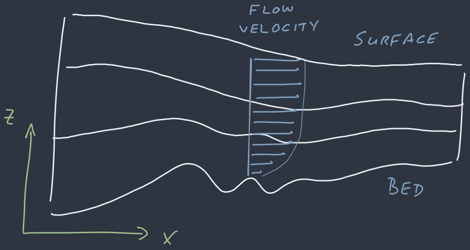
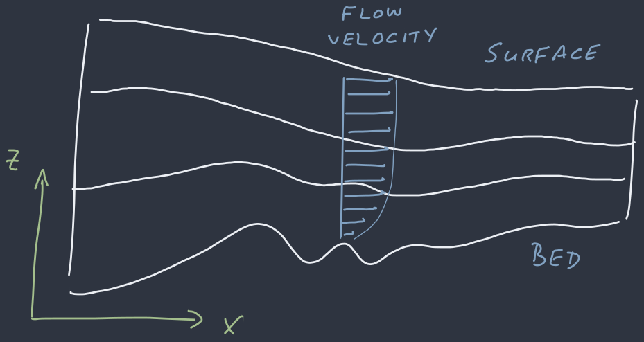
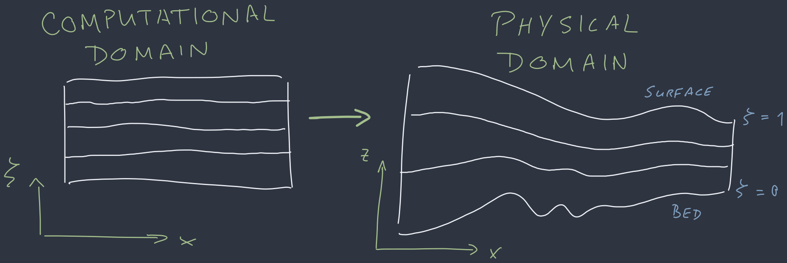
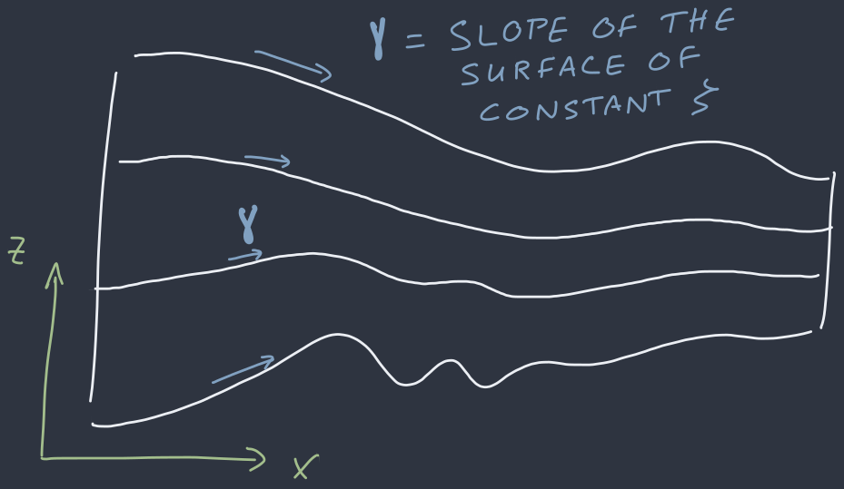
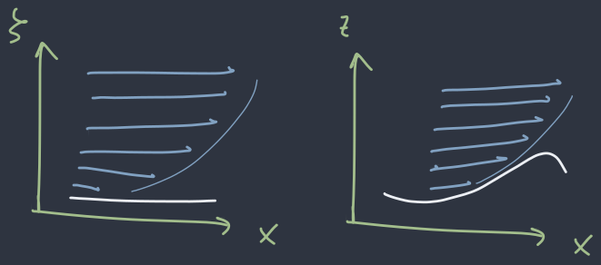
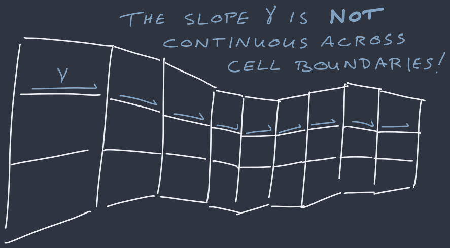
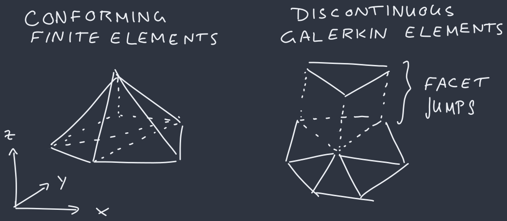
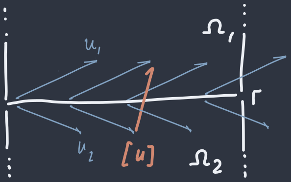

## Stokes flow in terrain-following coordinates

----

Daniel Shapero, shapero@uw.edu

University of Washington

-v-

### The problem

Simulating free-surface fluid flow is hard because **the geometry is changing in time**.

${}$

A problem in glaciology, but also in geodynamics!

-v-

The **orthodox** approach: Cartesian coordinates and a mesh that **evolves in time**

-v-

-v-

-v-

-v-

### What did I do?

Solve the **Stokes equations** in a coordinate system that follows the fluid surface.

-v-

### Why did I do this?

**Monolithic** coupling is necessary for:
* higher-order timestepping
* adaptive timestepping

-v-

<video width="640" height="480" controls>
  <source src="perlin-glacier.mp4" type="video/mp4">
  Your browser does not support the video tag.
</video>

-v-

<video width="640" height="480" controls>
  <source src="rayleigh-taylor.mp4" type="video/mp4">
  Your browser does not support the video tag.
</video>

---

## Prologue

-v-

### Main characters

| Field | Symbol | Rank | Units
| ----- | ------: | ---: | -----:
| velocity | $u$ | 1 | m yr${}^{-1}$
| stress | $\tau$ | 2 | kPa
| pressure | $p$ | 0 | kPa
| thickness | $h$ | 0 | m
| surface | $s$ | 0 | m
| bed | $b$ | 0 | m

-v-

### Constitutive law

The strain rate tensor:
$$\dot\varepsilon = \frac{1}{2}\left(\nabla u + \nabla u^\*\right)$$
Newtonian fluid:
$$\tau = 2\mu\dot\varepsilon$$

-v-

### Stokes flow

$$L(u, p) = \int\_{\Omega}\left(\frac{1}{2}\tau : \dot\varepsilon - p\nabla\cdot u - \rho g\cdot u \right)\mathrm dx$$

minimize this ⤴

-v-

### Free surface

Surface elevation follows the surface velocity + SMB

$$\frac{\partial s}{\partial t} + u\big|\_{z = s}\cdot\nabla s - w\big|\_{z = s} = \dot a - \dot m$$

---

## Terrain-following coordinates

-v-

-v-

$$\left[\begin{matrix} x\_1 \\\\ x\_2 \\\\ x\_3\end{matrix}\right] = \left[\begin{matrix}\xi\_1 \\\\ \xi\_2 \\\\ b(\xi\_1, \xi\_2) + \xi\_3\cdot h(\xi\_1, \xi\_2)\end{matrix}\right]$$

-v-

### Linearization

The slope of the coordinate surfaces:
$$\gamma \equiv \nabla b + \xi\_3\cdot\nabla h$$
The derivative of the map from $\xi \to x$ is:
$$J \equiv \frac{\mathrm dx}{\mathrm d\xi} = \left[\begin{matrix} I & 0 \\\\ \gamma^* & h\end{matrix}\right]$$

-v-

-v-

### Now what?

Everything else is calc 3

-v-

### The volume form

$$\mathrm dx = |\det J|\mathrm d\xi = h\\;\mathrm d\xi$$

-v-

### Velocities

$$u\_x = \frac{\mathrm dx}{\mathrm dt} = \frac{\mathrm dx}{\mathrm d\xi}\\;\frac{\mathrm d\xi}{\mathrm dt} = Ju\_\xi$$

-v-

-v-

### Gradients

$$\nabla\_x\phi = \frac{\mathrm d\phi}{\mathrm dx} = \frac{\mathrm d\phi}{\mathrm d\xi}\frac{\mathrm d\xi}{\mathrm dx} = \nabla\_\xi\phi\\;J^{-1}$$

-v-

### Divergences

* This one is less obvious:
$$\nabla\_x\cdot F\_x = \frac{1}{h}\nabla\_\xi\cdot (hF\_\xi)$$
* Soln: How do gradients and divergences relate?

-v-

$$L(u, p) = \int\_\Omega\left(\frac{h}{2}\tau :\dot\varepsilon - p\nabla\cdot hu - \rho gh\cdot Ju\right)\mathrm d\xi$$

where now the strain rate is

$$\dot\varepsilon = \frac{1}{2}\left\\{\nabla(Ju)J^{-1} + J^{-\*}\nabla(Ju)^\*\right\\}$$

---

## The hard part

-v-

### Oh no

$$\nabla\_xu\_x = \nabla\_\xi\left({\color{\#81A1C1}{J}} u\_\xi\right)J^{-1}$$

-v-

### Oh NO

-v-

### Solution

Give up for a couple years

-v-

### Solution

Use *discontinuous* Galerkin (DG) methods.

-v-

-v-

### General approach

$$\begin{align\*}
& \text{DG variational form} = \\\\
& \qquad {\color{#81A1C1}{\text{original variational form}}} \\\\
& \qquad\qquad + {\color{#A3BE8C}{\text{fluxes across facets}}} \\\\
& \qquad\qquad\qquad + {\color{#D08770}{\text{facet jump penalty}}}
\end{align\*}$$

-v-

-v-

### The variational form

$$\begin{align\*}
L(u, p) & = {\color{#81A1C1}{\int\_{\Omega}\left(\frac{1}{2}\tau : \dot\varepsilon - p\nabla\cdot u - \rho g \cdot u\right)\mathrm dx}} \\\\
& \qquad - {\color{#A3BE8C}{\sum\_{\Gamma}\int\_{\Gamma}\langle \tau - pI\rangle : [u\otimes n]\mathrm d\ell}} \\\\
& \qquad\qquad + {\color{#D08770}{\sum\_{\Gamma}\int\_{\Gamma}\frac{\alpha\mu}{2|\Gamma|}|[u]|^2\mathrm d\ell}}
\end{align\*}$$

-v-

### DG methods

* **Pros**: extremely flexible
* **Cons**: confusing, practitioners are annoying
* DG has a **pedagogy** problem!

-v-

### The variational form in TFC

$$\begin{align\*}
L(u, p) & = {\color{#81A1C1}{\int\_{\Omega}\left(\frac{h}{2}\tau : \dot\varepsilon - p\nabla\cdot hu - \rho gh\cdot Ju\right)\mathrm dx}} \\\\
& \qquad - {\color{#A3BE8C}{\sum\_{\Gamma}\int\_{\Gamma}\langle h(\tau - pI)\rangle : [Ju\otimes nJ^{-1}]\mathrm d\ell}} \\\\
& \qquad\qquad + {\color{#D08770}{\sum\_{\Gamma}\int\_{\Gamma}\frac{\alpha\mu}{2|\Gamma|}|[Ju]|^2\\; \langle h\rangle\\,\mathrm d\ell}}
\end{align\*}$$

---

### Results

-v-

<video width="640" height="480" controls>
  <source src="perlin-glacier.mp4" type="video/mp4">
  Your browser does not support the video tag.
</video>

-v-

<video width="640" height="480" controls>
  <source src="rayleigh-taylor.mp4" type="video/mp4">
  Your browser does not support the video tag.
</video>

-v-

### Future work

- Nonlinear rheology requires *hybridization*
- Contact problems
- Viscoelasticity
- Zero thickness

-v-

It has some redeeming qualities
